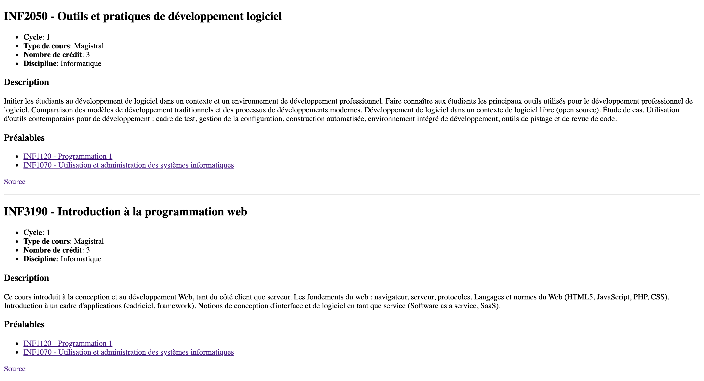

# HTML

Constuire une page web contenant votre horaire lors de la session d'automne 2020.

La page sera construite en utilisant uniquement du HTML (sans CSS).

Google Chrome sera utilisé pour tester l'affichage de la page web et l'éditeur de text de votre choix pour son écriture.

## Objectifs 

- Manipuler les éléments de base du HTML.
- Valider un document HTML.

## Exercices

Après chaque exercice, assurez-vous de valider votre document HTML à l'aide du [validateur du W3C](https://validator.w3.org/#validate_by_input) et de corriger toutes les erreurs et tous les avertissements.

Le but est de reporoduire la page suivante :

1 - Construisez un document HTML qui servira à contenir un horaire lors de la session d'automne 2020.
Au début le `body` ne va contenir que le titre (Horaire Automne 2020) et un tableau contenant votre emlpoi du temps de la semaine.

2 - Comme le montre l'image, ajouter les cours INF2050 et INF3190 où indiqué.

3 - Ajouter une section contenant le description des deux cours, en plus d'un lien à l'interieur de l'emploi du temps menant à la description de chaque cours.

4 - Ajouter un lien menant vers la source de chaque description. Ainsi que les préalables de chaque cours.

5 - En bas du titre, ajoutez un logo de l'UQAM. En cliquant sur le logo on devrait pouvoir se rendre sur site de l'UQAM : https://uqam.ca

6 - Essayez de reproduire les memes exercices avec votre propre horaire lors de la session d'automne 2020.
